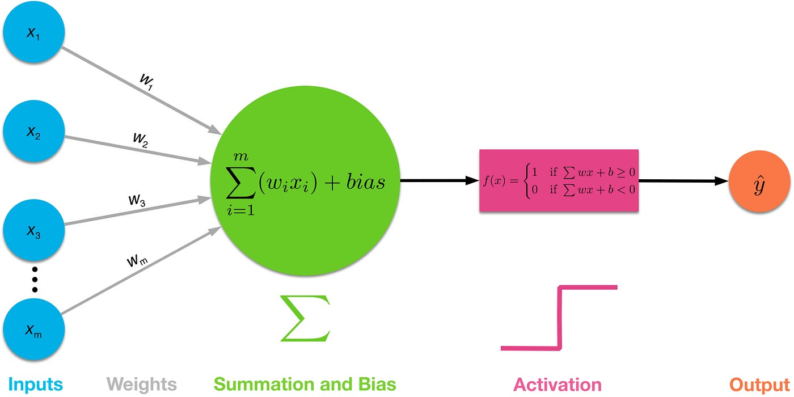

# Numpy-Neural-Network
Simple Numpy neural network from scratch using numpy. Followed Bert Gollnick's <a href = 'https://www.udemy.com/course/pytorch-ultimate'>Udemy Tutorial</a>

The neural network can be found on the neural_net.py file, and the ipynb notebook tested the neural network using a heart disease dataset. This implementation tried to implement the following simple type of neural network with no hidden layers and will be using sigmoid function to classify a heart disease:

